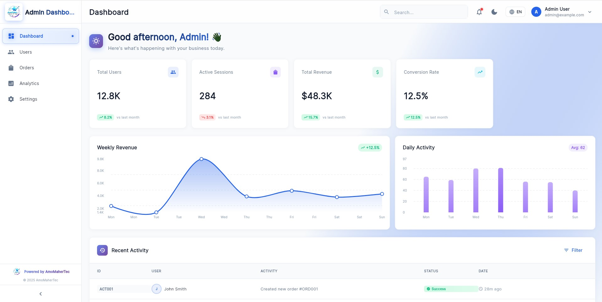
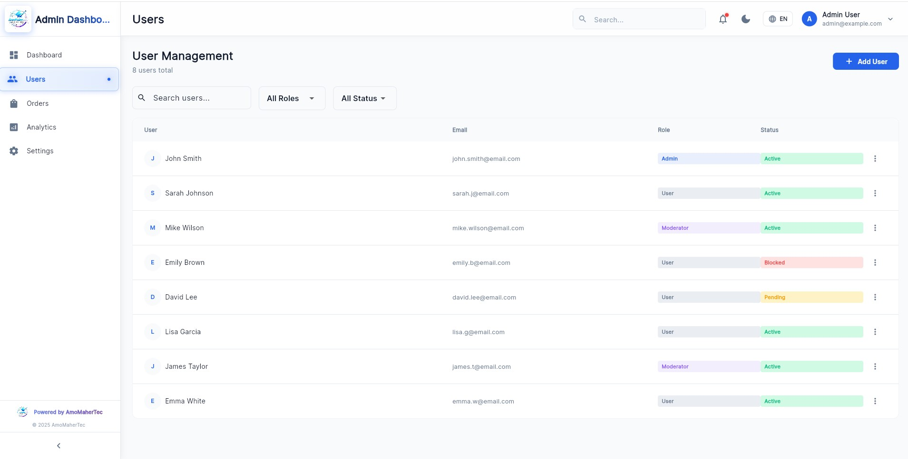
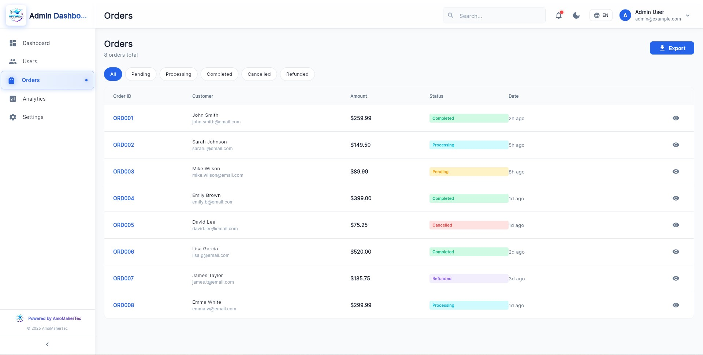
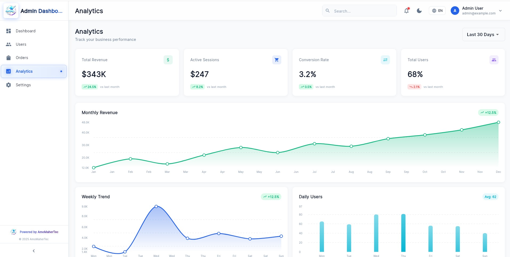
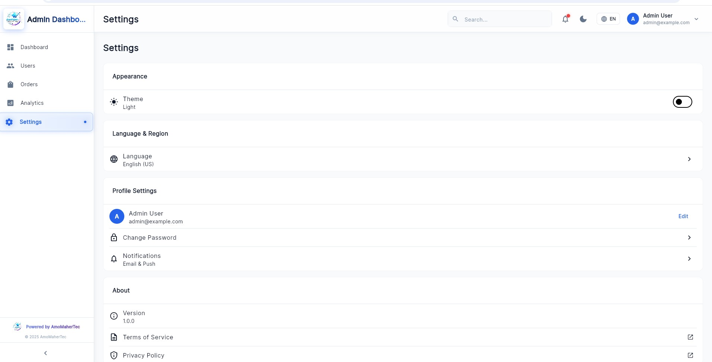

# Flutter Admin Dashboard

A high-performance, production-ready admin dashboard built with Flutter with a modern glassmorphism design, full multi-language (i18n) support and Right-to-Left (RTL) capability. Responsive across Web, Desktop, Tablet and Mobile.

---

## ✨ Highlights

- Responsive layout for Web / Desktop / Tablet / Mobile
- Glassmorphism-inspired UI with smooth animations and gradients
- Full localization (English, Arabic, French) and RTL support
- Light / Dark theme switching
- Analytics charts and admin screens (users, orders, etc.)
- Performance-minded architecture using Provider for state management

---

## 📸 Screenshots

| Dashboard | Users |
|----------|-------|
|  |  |

| Orders | Analytics |
|--------|-----------|
|  |  |

| Settings |
|----------|
|  |

---

## Tech Stack

- Flutter 3.x / 4.x compatible
- Material 3 design system
- State management: Provider (can be adapted to Riverpod)
- Charts: fl_chart
- Localization: flutter_localizations + intl (ARB files)
- Fonts: Google Fonts (Inter)
- Icons: Material Icons Rounded

---

## Quick Start

1. Clone the repository
```bash
git clone https://github.com/Maher-Tec/flutter-admin-dashboard.git
cd flutter-admin-dashboard
```

2. Install dependencies
```bash
flutter pub get
```

3. Run the app
- For web:
```bash
flutter run -d chrome
```
- For mobile / desktop:
```bash
flutter run
```

---

## Localization (i18n)

This project uses ARB files in `lib/l10n/`.

To add or update a language:

1. Create a new file `lib/l10n/app_<locale>.arb` (e.g. `app_es.arb`) and add translated keys.
2. Run the Flutter l10n generator:
```bash
flutter gen-l10n
```


---

## License & Author

Powered by AmoMaherTec — Maher-Tec  

---


